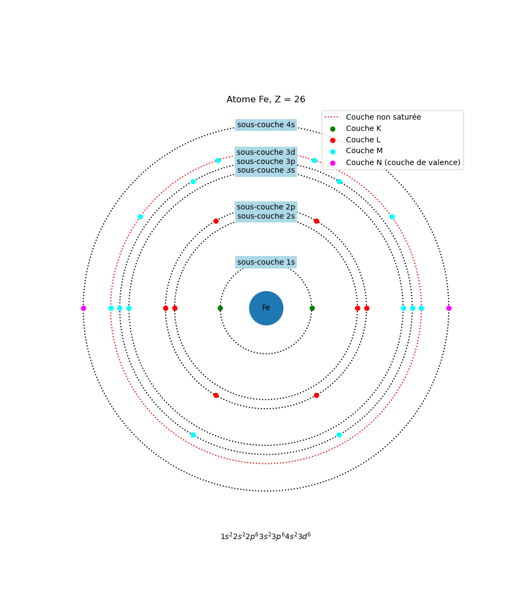

\newpage

# Introduction

La technologie a fait de nombreux progrès depuis les années 2000, principalement dans le domaine informatique.
En effet, celle-ci suivait une loi exponentielle: la puissance de calcul doublait tout les 18 mois.
etc....

\newpage
# Méthodologie

## Physique des fluides

### Les atomes

La matière est composé d'atomes, et chaque atome est composé d'un noyau possédant des neutrons et des protons (ayant une charge positive), et d'électrons (ayant une charge négative) gravitant autour du noyau.

Le modèle actuellement utilisé pour l'étude des atomes est la mécanique quantique.
Cependant, par soucis de simplicité, nous alons utiliser le modèle de Bohr, qui possède ses limites mais qui nous permettra d'avoir une idée plus précise de la nature d'un fluide.

Selon le modèle de Bohr, les électrons gravitent en couches autour du noyau.
Voici l'exemple de l'atome de Fer possédant 26 charges positives, obtenu grâce à la librairie matplotlib de python:

\center {width=85% #Fer caption="Illustration du modèle de Bohr en python"}

\raggedright

Sur ce shéma, nous pouvons voir plusieurs choses:

- Tout d'abord, les atomes gravitent en couches autour du noyau.
- Les couches sont divisées en sous-couches.
- Les couches et sous-couches ne sont pas remplies dans l'ordre.
En effet, si nous regardons le shéma, nous pouvons constater que la couche qui n'est pas saturée n'est pas la couche $N$, mais c'est la dernière sous-couche de la couche $M$.
- La dernière couche est appelée couche de valence.

### Les couches

Les atomes sont donc composés de couches, qui sont elles-mêmes divisées en sous-couches.
Mais avant tout, qu'est ce qu'une couche selon le modèle de Bohr ?

Selon le modèle quantique, une couche symbolise un niveau d'énergie quantifié. Les électrons se trouvant sur une couche possèdent donc le niveau d'énergie indiqué par la couche.
Une couche éloignée du noyau (comme par exemple la couche $N$) représentera un niveau d'énergie plus grand qu'une couche proche du noyau (comme par exemple la couche $K$).

Chaque couche $n$ possède un nombre maximum d'électrons $2n^2$. Ceux-ci sont répartis entre les sous-couches.

La couche de valence est la dernière couche.

Les sous-couches peuvent accepter un nombre maximum d'électrons.
La première sous-couche est communément appelée `s` et accepte au maximum 2 électrons.
La $n$ ième sous-couche peut accepter au maximum $2 + 4n$ électrons.

### La règle de l'octet et la molécule $H_{2}O$

La règle de l'octet s'applique uniquement aux atomes appartenant au groupe principal (les atomes du groupe principal possèdent au plus 3 couches avec uniquement la sous-couche s et p de la couche 3), qui possèdent un numéro atomique supérieur ou égal à 4.

Cette règle stipule que les électrons des sous-couches `s` et `p` (`p` est le nom de la $2^e$ sous-couche) vont essayer de se combiner pour arriver à 8 électrons. Cela leur permet d'avoir une configuration stable.

Prenons l'exemple de l'atome d'oxygène (O, Z = 8).
Nous pouvons voir sur le shéma que celui-ci ne possède que 4 électrons dans la couche 2p.
Comme l'oxygène appartient au groupe principal et possède un numéro atomique supérieur ou égal à 4, la règle de l'octet peut s'appliquer.

La combinaison de la couche 2s et 2p nous donne seulement 6 électrons.
L'atome d'oxygène va donc tenter de récupérer 2 électrons pour arriver à un état stable.

L'atome d'hydrogène (H, Z = 1) ne possède qu'une seule charge positive.
Pour être dans un état stable, celui-ci va essayer de saturer sa couche de valence, donc d'acquérir un électron.

Ainsi, l'atome d'oxygène va essayer de récupérer 2 électrons et l'atome d'hydrogène va essayer de récupérer 1 électron.
L'atome d'hydrogène va donc partager son électron avec l'atome d'oxygène, qui va faire la même chose: ainsi, l'atome d'oxygène possède un de ses électrons gravitant autour de l'hydrogène et de lui-même (comme cela l'hydrogène est dans un état stable), et l'électron de l'atome d'hydrogène gravite également autour de l'oxygène.
Ainsi, l'hydrogène, en partageant son électron, est dans un état stable.
S'il y a un deuxième atome d'hydrogène, les deux atomes d'hydrogènes sont dans un état stable car l'atome d'oxygène partage avec eux des électrons, et l'atome d'oxygène est également dans un état stable car chaque atome d'hydrogène partage avec lui un électron.

Comme chacun des atomes possède sa couche de valence saturée, il est heureux et ne voit aucune raison de partir pour se retrouver dans un état non stable. Les atomes restent donc groupés, liés entre eux par les partages d'électrons.

Cela forme la molécule d'eau $H_{2}O$.

### Liaisons chimiques

Il existe plusieurs liaisons entre les molécules.

- Les liaisons fortes: elles sont responsables de la matière solide.
- Les liaisons faibles: elles sont responsables de la matière liquide.

### Méthode SPH (Smooth Particle Hydro
