\newpage

# Introduction

La technologie a fait de nombreux progrès depuis les années 2000, principalement dans le domaine informatique.
En effet, celle-ci suivait une loi exponentielle: la puissance de calcul doublait tout les 18 mois.
etc....

\newpage
# Méthodologie

## Physique des fluides

Nous allons étudier le comportement dynamique des fluides afin de savoir comment modéliser et simuler cela au moyen de différentes méthodes.

Les équations exactes qui régissent les fluides ne sont pas encore connues.
Cependant, de nombreux scientifiques se sont penchés sur la question et ont donné des solutions approximant la solution exacte.

### Les atomes

La matière est composé d'atomes, et chaque atome est composé d'un noyau possédant des neutrons et des protons (ayant une charge positive), et d'électrons (ayant une charge négative) gravitant autour du noyau.

Le modèle actuellement utilisé pour l'étude des atomes est la mécanique quantique.
Cependant, par soucis de simplicité, nous alons utiliser le modèle de Bohr, qui possède ses limites mais qui nous permettra d'avoir une idée plus précise de la nature d'un fluide.

Selon le modèle de Bohr, les électrons gravitent en couches autour du noyau.
Voici l'exemple de l'atome de Fer possédant 26 charges positives, obtenu grâce à la librairie matplotlib de python:

\center {width=85% #Fer caption="Illustration du modèle de Bohr en python"}

\raggedright

Sur ce shéma, nous pouvons voir plusieurs choses:

- Tout d'abord, les atomes gravitent en couches autour du noyau.
- Les couches sont divisées en sous-couches.
- Les couches et sous-couches ne sont pas remplies dans l'ordre.
En effet, si nous regardons le shéma, nous pouvons constater que la couche qui n'est pas saturée n'est pas la couche $N$, mais c'est la dernière sous-couche de la couche $M$.
- La dernière couche est appelée couche de valence.

### Les couches

Les atomes sont donc composés de couches, qui sont elles-mêmes divisées en sous-couches.

Mais avant tout, qu'est ce qu'une couche selon le modèle de Bohr ?

Selon le modèle quantique, une couche symbolise un niveau d'énergie quantifié. Les électrons se trouvant sur une couche possèdent donc le niveau d'énergie indiqué par la couche.
Une couche éloignée du noyau (comme par exemple la couche $N$) représentera un niveau d'énergie plus grand qu'une couche proche du noyau (comme par exemple la couche $K$).

Chaque couche $n$ possède un nombre maximum d'électrons $2n^2$. Ceux-ci sont répartis entre les sous-couches.

La couche de valence est la dernière couche.

Les sous-couches peuvent accepter un nombre maximum d'électrons.
La première sous-couche est communément appelée `s` et accepte au maximum 2 électrons.
La $n$ ième sous-couche peut accepter au maximum $2 + 4n$ électrons.

### Les liaisons chimiques

Il existe plusieurs types de liaisons entre les atomes, les molécules et les ions.
Parmi ces liaisons, nous allons nous intéresser plus particulièrement à:

- liaison covalente
- liaison hydrogène

#### Liaison covalente

Voici deux atomes et leur représentation:

```plantuml
@startuml

<style>
note {
    linecolor transparent
    backgroundcolor white
}
</style>

note as O
    <img:/home/fitzwilliam/Documents/bachelor/images/physique/O.png>
end note

note as H
    <img:/home/fitzwilliam/Documents/bachelor/images/physique/H.png>
end note

O -[hidden]r-> H

@enduml
```

Nous pouvons constater que ces deux atomes ont leur couche de valence non saturée.

Selon la règle de l'octet (s'appliquant uniquement aux atomes ayant une deuxième couche, et éventuellement les deux premières sous-couches de la troisième couche), les atomes vont essayer d'avoir leur couche de valence saturée pour atteindre un état stable.

Dans notre cas, la règle de l'octet peut s'appliquer à l'atome d'oxygène, car celui-ci possède 2 couches, mais pas à l'atome d'hydrogène.

Cependant, l'atome d'hydrogène va également essayer de saturer sa couche de valence pour arriver dans un état stable.

Chaque atome d'hydrogène va donc chercher un électron suplémentaire, et l'atome d'oxygène va chercher 2 électrons suplémentaires (en effet sa couche de valence ne contient que 4 électrons alors que pour être saturée, celle-ci doit en contenir 6...)

La solution à ce problème est la liaison covalente: chaque atome d'hydrogène va partager son électron avec l'atome d'oxygène, et l'atome d'oxygène va partager un électron avec chacun des 2 atomes d'hydrogène.
Ainsi, grâce à ce partage d'électrons, chacun des atomes a sa couche de valence saturé et est donc dans un état stable ! Les électrons partagés entre 2 atomes gravitent autour des 2 atomes, les liant entre eux par une liaison covalente.
Ces liaisons covalentes créent une nouvelle molécule, la molécule de l'eau $H_{2}O$. En effet, comme chacun des atomes a atteint un état stable par le partage d'électrons, aucun ne voudra partir pour se retrouver à nouveau dans un état pas stable... (Pour changer la molécule, il faut faire des réactions chimiques)

#### Liaison hydrogène

Nous allons reprendre notre molécule d'eau et voir comment les liaisons hydrogène s'appliquent pour notre molécule.

La molécule est donc composée de plusieurs atomes liés entre eux par des liaisons covalentes.
Cependant, nous avons également vu que les atomes sont composés de charges positives (dans le noyau), et de charges négatives (les électrons gravitant autour du noyau).
L'électronégativité d'un atome est donc une grandeur relative qui traduit l'aptitude de cet atome à attirer vers lui le doublon d'électron liant obtenu par la liaison covalente.
Si l'électronégativité des deux atomes est différente, la liaison entre les deux atomes est polarisée: un dipôle électrique est créé
(un dipôle électrique est composé d'une charge positive et d'une charge négative séparé par une distance fixée).
Une molécule peut avoir plusieurs liaisons covalentes polarisées.

Dans le cas de l'oxygène et l'hydrogène, l'oxygène est très électronégatif, plus que l'hydrogène. Donc les liaisons covalentes seront polarisées.

Voici l'exemple de la polarisation de la molécule d'eau $H_{2}O$:

Dans le graphique, nous pouvons constater 2 flèches. Ces 2 flèches sont le moment dipolaire de chacune des liaisons covalentes polaires, orienté du pôle - vers le pôle +.
Les nombres indiquent l'électronégativité de chacun des atomes.

Une liaison hydrogène se produit lorsqu'un atome d'hydrogène lié à un atome très électronégatif interagit avec un autre atome également très électronégatif et porteur d'un doublet d'électrons non liant.
C'est une force intermoléculaire moins forte que la liaison covalente.

Dans le cas des molécules d'eau, l'oxygène est très électronégatif.
De plus, l'oxygène partage 2 électrons, donc possède sur sa 2ème couche 2 électrons non liant.
Et l'oxygène est lié à l'hydrogène par des liaisons covalentes polarisées.

Donc lorsqu'on met plusieurs molécules d'eau ensemble, des liaisons hydrogènes se produisent entre les molécules d'eau.

Les molécules d'eau sont donc maintenues ensembles par une force intermoléculaire.
Si une molécule d'eau est en mouvement, elle aura une influence sur les autres molécules d'eau avoisinant à cause de ces liaisons hydrogènes.

## Méthode SPH

C'est à cet instant qu'intervient la méthode de simulation de fluides SPH (Smoothed Particle Hydrodynamics).

Cette méthode représente un fluide comme un ensemble de particules.
Chaque particule possède une influence sur les autres particules.

Cette méthode est basée sur une méthode lagrangienne sans maillage.
Différents paramètres physiques sont ajustables.

Nous pouvons constater que cette méthode est assez proche de la réalité, étant donné les considérations précédentes.

### La règle de l'octet et la molécule $H_{2}O$

La règle de l'octet s'applique uniquement aux atomes appartenant au groupe principal (les atomes du groupe principal possèdent au plus 3 couches avec uniquement la sous-couche s et p de la couche 3), qui possèdent un numéro atomique supérieur ou égal à 4.

Cette règle stipule que les électrons des sous-couches `s` et `p` (`p` est le nom de la $2^e$ sous-couche) vont essayer de se combiner pour arriver à 8 électrons. Cela leur permet d'avoir une configuration stable.

Prenons l'exemple de l'atome d'oxygène (O, Z = 8).
Nous pouvons voir sur le shéma que celui-ci ne possède que 4 électrons dans la couche 2p.
Comme l'oxygène appartient au groupe principal et possède un numéro atomique supérieur ou égal à 4, la règle de l'octet peut s'appliquer.

La combinaison de la couche 2s et 2p nous donne seulement 6 électrons.
L'atome d'oxygène va donc tenter de récupérer 2 électrons pour arriver à un état stable.

L'atome d'hydrogène (H, Z = 1) ne possède qu'une seule charge positive.
Pour être dans un état stable, celui-ci va essayer de saturer sa couche de valence, donc d'acquérir un électron.

Ainsi, l'atome d'oxygène va essayer de récupérer 2 électrons et l'atome d'hydrogène va essayer de récupérer 1 électron.
L'atome d'hydrogène va donc partager son électron avec l'atome d'oxygène, qui va faire la même chose: ainsi, l'atome d'oxygène possède un de ses électrons gravitant autour de l'hydrogène et de lui-même (comme cela l'hydrogène est dans un état stable), et l'électron de l'atome d'hydrogène gravite également autour de l'oxygène.
Ainsi, l'hydrogène, en partageant son électron, est dans un état stable.
S'il y a un deuxième atome d'hydrogène, les deux atomes d'hydrogènes sont dans un état stable car l'atome d'oxygène partage avec eux des électrons, et l'atome d'oxygène est également dans un état stable car chaque atome d'hydrogène partage avec lui un électron.

Comme chacun des atomes possède sa couche de valence saturée, il est heureux et ne voit aucune raison de partir pour se retrouver dans un état non stable. Les atomes restent donc groupés, liés entre eux par les partages d'électrons.

Cela forme la molécule d'eau $H_{2}O$.

### Liaisons chimiques

Il existe plusieurs liaisons entre les molécules.

- Les liaisons fortes: elles sont responsables de la matière solide.
- Les liaisons faibles: elles sont responsables de la matière liquide.

### Méthode SPH (Smooth Particle Hydro
