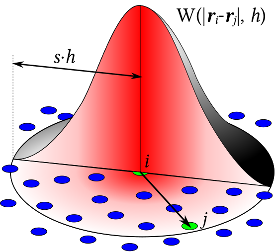

# Méthode SPH

## Histoire

La méthode Smoothed Particle Hydrodynamics (SPH) a été inventée en 1977 par Bob Gingold et Joe Monaghan @gingold et indépendamment par Leon Lucy @lucy afin de simuler des phénomènes astrophysiques, tel que la formation et l'évolution d'une étoile ou d'une galaxie.
Il s'agissait tout d'abord d'une approche probabiliste.
Les équations de la mécanique des fluides pouvaient effectivement servir à décrire ce genre de phénomènes astrophysiques car il s'agit de gaz ou d'une multitude de corps évoluant d'une manière similaire à un liquide ou un gaz.

La méthode SPH s'est ensuite développée dans le domaine de la mécanique des fluides ou elle a servit notamment à modéliser non seulement des fluides compressibles et incompressibles, mais également des phénomènes thermiques et magnétiques.

Puis vers 1990, la méthode SPH a été étendue à la mécanique des structures afin de simuler par exemple des impact à forte vitesse ou des déchirures de matériaux grâce notamment au travail de Libersky et Petschek (citation ici).

De nos jour, la méthode SPH est encore utilisée dans la mécanique des fluides, mais également pour simuler des impacts haute vitesse, des fragmentations ou encore des explosions, si bien que le terme Hydrodynamics n'est plus adapté.
Cependant, pour des raisons historiques, on conserve le terme Hydrodynamics.

## Interpolation

La méthode SPH utilise une technique d'interpolation afin de déterminer le résultat des équations de Navier-Stokes [-@sec-NSE].

L'interpolation utilisée dans la méthode SPH est basée sur le principe que la distribution de Dirac $\delta(r)$, appelée par abus de langage fonction Dirac et définie dans l'équation [-@eq-dirac], peut être considérée comme l'élément neutre de la convolution, comme nous montre l'équation [-@eq-conv1].
Étant une distribution de probabilité, la fonction Dirac respecte la propriété d'une distribution, donc on a la propriété [-@eq-dirac1].
$$
\begin{aligned}
f * \delta(x)
&= \int_{y} f(y) \delta(y - x) \\
&= f(x)
\end{aligned}
$$ {#eq-conv1}

avec:

$$
\delta(x) = \left\{
\begin{aligned}
1 & \ \text{si} \ x = 0 \\
0 & \ \text{sinon}
\end{aligned}
\right.
$$ {#eq-dirac}

et:

$$
\int \delta(x) dx = 1
$$ {#eq-dirac1}

On définit donc une fonction noyau $W$ qui est une approximation de la fonction Dirac et qui respecte les propriétés [-@eq-propW1] et [-@eq-propW2].

$$
\int_{r}W(r, h)dr = 1
$$ {#eq-propW1}
$$
\lim_{h\rightarrow 0} W(r, h) = \delta(r)
$$ {#eq-propW2}

L'équation [-@eq-conv1] devient alors l'équation [-@eq-conv2].

$$
\begin{aligned}
f * W(x)
&= \int_{y} f(y) W(y - x) \\
&\approx f(x)
\end{aligned}
$$ {#eq-conv2}

## Principes de base

La méthode SPH représente le fluide comme un ensemble de particules interagissant entre elles.
Elle simule le comportement de chaque particule, donc il s'agit d'une méthode lagrangienne.

De plus, la méthode SPH est une méthode sans maillage, ce qui signifie en d'autres termes qu'elle ne nécessite pas de maillage fixe.
Cela implique que la méthode SPH peut être utilisée avec une taille de domaine adaptative, et est donc particulièrement adaptée pour des problèmes complexes car on ne fera que la quantité de calcul nécessaire.
Par exemple, si on pense à simuler un verre d'eau se renversant sur une table, la méthode SPH sera particulièrement adaptée car elle ne calculera que les endroits où le fluide est présent et pas toute la table comme le ferait une méthode avec maillage fixe qui devrait définir un domaine de calcul fixe et s'y tenir.

Elle ne tente pas de résoudre les équations du fluide dans une grille fixe.... (reformuler ?)

Comme la méthode SPH est une méthode sans maillage, elle utilise une technique d'interpolation afin de déterminer le résultat des équations aux dérivées partielles.

(à nettoyer !!=

La méthode SPH simule le fluide comme un ensemble de particules.
Ces particules possèdent leurs caractéristiques propres tel que leur masse, leur position, leur vitesse.
Une particule interagit avec les particules l'avoisinant à travers un noyau de lissage $W$.
Cependant, une particule ne peut pas interagir avec toutes les particules...
Par exemple, on ne veut pas qu'une particule à une extrémité du fluide interagisse avec une particule à l'autre extrémité du fluide.
Ainsi, une distance $h$ est fixée afin que les particules qui se trouvent à une distance supérieur à $h$ ne possèdent pas d'influence sur la particule.
Ainsi, on peut définir une équation [-@eq-inter] qui décrit comment une propriété physique $A_{S}$ à un point donné du fluide est calculée grâce aux propriétés physiques $A_{i}$ des particules avoisinant le point donné, pondéré par le noyau de lissage $W$ donnant l'influence des particules avoisinantes, comme nous pouvons le voir sur la figure [-@fig-W].

$$
A_{S}(r) = \sum_{i} m_{i} \frac{A_{i}}{\rho_{i}}W(r - r_{i}, h)
$$ {#eq-inter}

avec:

- $m_{i}$ la masse de la particule $i$
- $A_{i}$ une propriété de la particule $i$
- $\rho_{i}$ la densité de la particule $i$
- $W$ le noyau utilisé pour l'interpolation
- $h$ le rayon d'influence du noyau d'interpolation. Ainsi, on a $W = 0$ si $|r - r_{i}| > h$.

{#fig-W .figure-right width=30%}

La méthode SPH donne donc les propriétés physiques d'un point donné par une combinaison des propriétés des particules voisines.
Dans notre cas, la méthode SPH résoud l'équation de la conservation de la masse [-@eq-econt] et l'équation de la conservation de la quantité de mouvement [-@eq-nmouv], mais pas l'équation de la conservation de l'énergie [-@eq-nener], car la température n'est pas prise en compte.

Pour plus de précisions, consultez le travail de thèse de Fabien Caleyron @Fabien, mais également le travail de master de Marcus Vesterlund @Marcus et le travail de thèse de Alban Vergnaud @Alban.
Cette partie a été écrite principalement avec les informations données par @Marcus et @Alban.

## Avantages

Les principaux avantages de la méthode SPH sont que celle-ci est une méthode

- sans maillage: en effet, cela permet à la méthode SPH de simuler des problèmes avec une dynamique de frontière complexe tel que des fluides à surface libre ou des fluides avec beaucoup de déplacement de frontières.
  De plus, l'avantage de la méthode sans maillage est sa facilité d'implémentation et surtout de parallélisation.
  En effet, il est plus facile de séparer le calcul entre plusieurs unités de calcul, car on regarde en chaque point du fluide quels sont ses caractéristiques locales.

- Comme nous l'avons mentionné plus haut, la méthode SPH peut également être utilisée d'une manière plus générale comme pour la simulation d'impact à haute vitesse sur un matériaux ou encore pour la simulation d'explosions ou de fragmentations.

- qui permet une bonne conservation de la masse... (À développer ???)

## Désavantages

Cependant, la méthode SPH possède également des inconvénients.
En effet, cette méthode n'est pas bien définie aux frontières, ce qui rend la méthode difficile à calculer, comme le faisait remarquer @Shadloo.
Mais des travaux ont été faits afin de palier à ce problème, tel que @Adam et @Kostorz.

(À compléter !!!)

